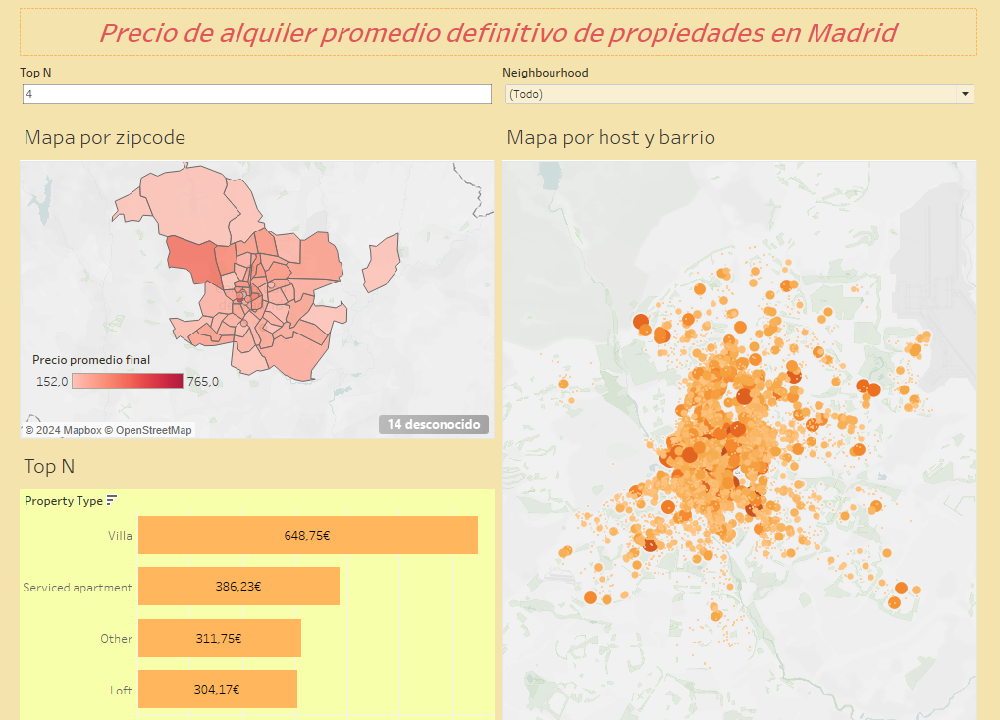

# Práctica Tableau: Análisis de Datos de AirB&B en Madrid

Este repositorio contiene un proyecto de análisis de datos realizado en Tableau Desktop sobre datos de AirB&B en la ciudad de Madrid. Se utilizó un archivo CSV como fuente de datos para explorar relaciones entre precios, tipos de propiedad y reviews en distintos barrios de Madrid.

## Objetivo

El objetivo principal de este proyecto es visualizar y analizar patrones y tendencias en los datos de AirB&B en Madrid, lo cual puede ser útil para comprender el mercado de alquiler vacacional en la ciudad.

## Contenido

- `PracticaTableua.twb archivos/`: Carpeta que contiene el archivo CSV con los datos de AirB&B en Madrid.
- `images/`: Carpeta que contiene capturas de pantalla del dashboard generado en Tableau.

## Visualizaciones

Se han creado diversas visualizaciones en Tableau con un KPI en común (Precio final en promedio(precio+fianza+servicio de limpieza)):

- **Mapa de Madrid por zip code**: Visualización que muestra la distribución de precios finales por zip code, con un tooltip dónde se puede ver un gráfico con el detalle de numero de reviews por tipo de alojamiento para cada zip code específico.
- **TopN**: Gráfico que muestra el precio final por tipo de propiedad para la ciudad de Madrid.
- **Mapa por host y barrio**: Permite al usuario seleccionar un barrio específico para visualizar las reservas.

## Cómo utilizar

1. Clona este repositorio en tu máquina local.
2. Abre Tableau Desktop.
3. Importa el archivo CSV ubicado en la carpeta `PracticaTableua.twb archivos/`.
4. Explora las visualizaciones predefinidas o crea nuevas visualizaciones según tus necesidades.
5. Para ver los resultados por barrio y Top N, utiliza los filtros interactivos disponibles en las visualizaciones.

## Contribuciones

Las contribuciones son bienvenidas. Si deseas mejorar este proyecto, por favor abre un problema o envía una solicitud de extracción.
